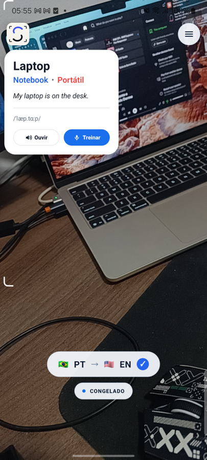
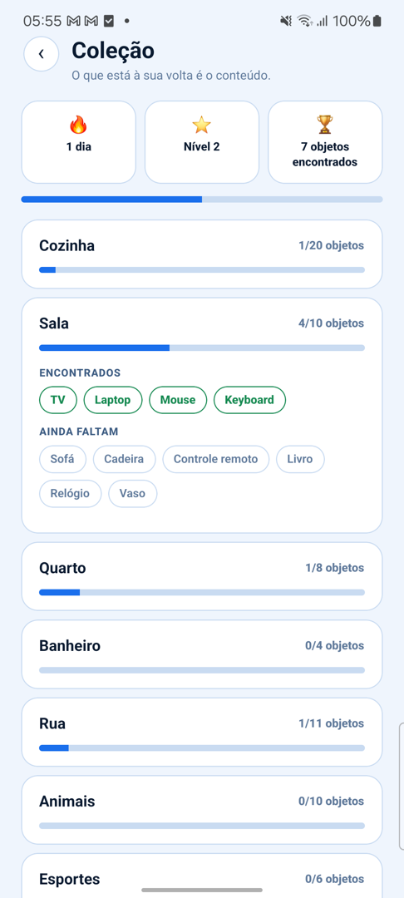
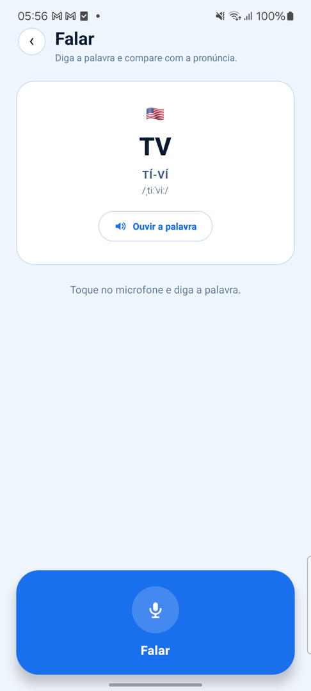
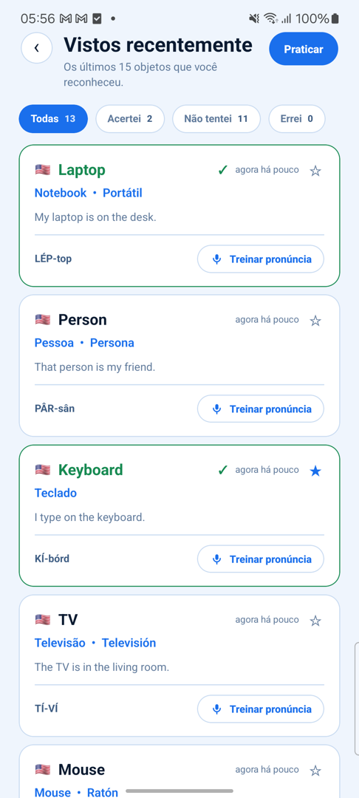
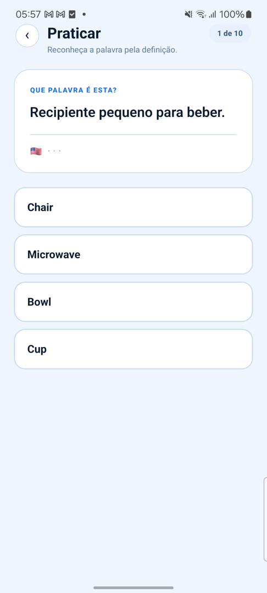

<h1 align="center">📸 SayLens</h1>

<p align="center">
  <b>Point your phone at anything. Learn what it is called.</b><br />
  A React Native app that turns the camera into an English tutor — every object
  it sees gets a card with the word, its meaning, and how to say it.
</p>

<p align="center">
  
  
  
  
</p>

<p align="center">
  
</p>

<p align="center">
  <sub>🔒 No image ever leaves the device. No account. No server. No network call to recognise anything.</sub>
</p>

---

## ✨ What it does

You open the camera and point it at your desk. SayLens finds the objects in
frame and stands a small card beside each one — the English word, the
translation, an example sentence, and the pronunciation. Tap **Listen** to hear
it, tap **Practise** to say it back and find out whether you got it right.

Everything you meet is remembered: words you have seen, words you have
pronounced correctly, rooms you have completed, and a quiz that only asks about
words you have actually met.

---

## 🎬 The screens

<p align="center">
  
  &nbsp;&nbsp;
  
  &nbsp;&nbsp;
  
</p>

<table align="center">
  <tr>
    <td align="center" width="33%">
      <b>📷 Camera</b><br />
      <sub>A card per detected object, standing beside it, sized by how near
      it is</sub>
    </td>
    <td align="center" width="33%">
      <b>🏆 Collection</b><br />
      <sub>Streak, level, and one room per set of objects left to find</sub>
    </td>
    <td align="center" width="33%">
      <b>🎤 Speak</b><br />
      <sub>Say the word out loud and compare it with the device recogniser</sub>
    </td>
  </tr>
</table>

<p align="center">
  
  &nbsp;&nbsp;
  
</p>

<table align="center">
  <tr>
    <td align="center" width="33%">
      <b>📚 History</b><br />
      <sub>Every word you have met, coloured by how your pronunciation went</sub>
    </td>
    <td align="center" width="33%">
      <b>🧩 Practice</b><br />
      <sub>Ten questions a round, drawn only from words you have already seen</sub>
    </td>
  </tr>
</table>

<p align="center">
  <sub>Captured on a physical Samsung SM-M536B running Android 14.</sub>
</p>

---

## 🧠 How it works, in three steps

|                |                                                                                                                     |                             |
| -------------- | ------------------------------------------------------------------------------------------------------------------- | --------------------------- |
| **1. See** 👁️  | A neural network reads every camera frame on the phone itself and returns a box around each object it recognises.   | 4.4 MB model, bundled       |
| **2. Name** 🔤 | Each box is matched to a curated vocabulary entry: word, translation, meaning, example sentence, phonetic spelling. | 80 everyday objects         |
| **3. Say** 🗣️  | The device speaks the word, listens to you repeat it, and records whether it matched.                               | System voice and recogniser |

---

## ⚡ Measured, not estimated

Every number here came off a physical phone, never a simulator.

| Device              | Detections per second          | Median inference |
| ------------------- | ------------------------------ | ---------------- |
| 📱 iPhone 13 (A15)  | **49.9**                       | **33 ms**        |
| 📱 Samsung SM-M536B | **~30** (capped by the camera) | —                |

The full record, including the design that was measured and then thrown away,
is in [physical-device validation](docs/VALIDATION.md).

---

## 🚀 Run it

You need Node 24.11.1 (pinned in `.nvmrc`), and then:

```sh
nvm use
npm ci
npm run validate
```

<details>
<summary><b>📱 Android</b> — JDK 17, SDK Platform 37, a device with USB debugging</summary>

<br />

Start Metro in one terminal:

```sh
npm start
```

Then, in another, point Metro at the device and install:

```sh
adb devices -l
adb -s <device-serial> reverse tcp:8081 tcp:8081
npm run android -- --device <device-serial>
```

The first build downloads the Gradle distribution and may install the pinned
SDK components. The model is packaged with the app, so nothing is downloaded at
runtime.

</details>

<details>
<summary><b>🍎 iOS</b> — Xcode 26 or newer, CocoaPods, a physical iPhone</summary>

<br />

```sh
npm ci
cd ios && pod install
```

Open `ios/SayLens.xcworkspace` — the workspace, not the project — or run:

```sh
npx react-native run-ios --device
```

The simulator builds and launches, but its camera is a static image, so there
is nothing there for the detector to find. Use a real device.

</details>

---

## 🏗️ Under the hood

<details open>
<summary><b>Architecture</b></summary>

<br />

Feature-first Clean Architecture, with MVVM inside the presentation layer.
Views receive plain state and callbacks and never import a platform SDK; the
camera, the detector, the voice, and storage all sit behind ports that the
feature declares and the app composes.

```text
src/
  app/                    Shell, theme, navigation, and app ViewModel
  features/learning/      Domain, use cases, adapters, Views, and ViewModels
  shared/                 Proven cross-feature primitives only

android/                  Android application and native modules
ios/                      iOS application and native modules

modules/
  vision-object-detector/ Nitro detector boundary, Kotlin and Swift

docs/
  adr/                    Architecture Decision Records
  assets/                 Visual evidence captured from physical devices
```

</details>

<details>
<summary><b>The detector</b></summary>

<br />

Both platforms run MediaPipe Tasks with the same EfficientDet-Lite0 int8 model,
read from one file in this repository, at the same score threshold and result
ceiling — so a difference between the platforms is a difference in hardware
rather than in what was asked of the model.

Native side, per platform, behind one Nitro boundary:

- a pool of workers, each holding its own detector;
- frames copied on the camera queue, because the capture session recycles its
  buffer the moment the callback returns;
- a frame offered to the first idle worker and **dropped** if none is idle — a
  queue would only make results older, and an old result is what makes a card
  look detached from the object under it;
- tracking that carries a box and its name from one frame to the next, so a
  single bad frame cannot rename what the learner is looking at.

The iOS layer, and the three defects a physical iPhone found that no amount of
code reading would have, are written up in
[the iOS native layer](docs/IOS.md).

</details>

<details>
<summary><b>Stack</b></summary>

<br />

- **React Native 0.87** with the new architecture, TypeScript throughout.
- **VisionCamera 5** for the camera session and frame output.
- **Nitro Modules** for the detector boundary: Kotlin on Android, Swift on iOS.
- **MediaPipe Tasks**, EfficientDet-Lite0 int8, bundled — no download, no
  backend, no network permission needed to recognise anything.
- **Reanimated** interpolation on the UI thread, so the overlay stays smooth
  between detections instead of stepping with them.
- **styled-components** for the shared theme.

</details>

<details>
<summary><b>Decisions, and the ones that were reversed</b></summary>

<br />

Every architectural choice is recorded as an ADR with its context, its
trade-offs, and — where it happened — the evidence that later overturned it.
[ADR-0009](docs/adr/0009-ios-vision-detector.md) chose Apple's Vision framework
for iOS on a solid argument;
[ADR-0010](docs/adr/0010-ios-shares-the-android-detector.md) took it apart with
what a physical iPhone showed. Both are kept.

Read the [full index](docs/adr/README.md).

</details>

---

## 📚 Documentation

|                                                               |                                                           |
| ------------------------------------------------------------- | --------------------------------------------------------- |
| 🏛️ [Architecture and dependency rules](docs/ARCHITECTURE.md)  | How the layers are allowed to depend on each other        |
| 🍎 [The iOS native layer](docs/IOS.md)                        | Swift detector, voice modules, and what the device proved |
| 🧾 [Architecture Decision Records](docs/adr/README.md)        | Every decision, including the reversed ones               |
| 📊 [Physical-device validation](docs/VALIDATION.md)           | Numbers, methods, and limits                              |
| 🏎️ [Performance engineering strategy](docs/PERFORMANCE.md)    | Treating this workload as a case study                    |
| 🗺️ [Roadmap](docs/ROADMAP.md)                                 | Milestones and acceptance criteria                        |
| 🤝 [Contribution workflow](CONTRIBUTING.md)                   | Before you open a change                                  |
| 🧠 [Model card](modules/vision-object-detector/MODEL_CARD.md) | Source, licence, limitations, checksum                    |

---

## 🤝 Contributing

The project is open to technical discussion. Before opening a change, read
[CONTRIBUTING.md](CONTRIBUTING.md), preserve the dependency rule, and keep
commits small and semantic.

## 📄 License

A license will be selected before the first public release. Until then, no
permission to copy, modify, or redistribute the code is granted by default.
