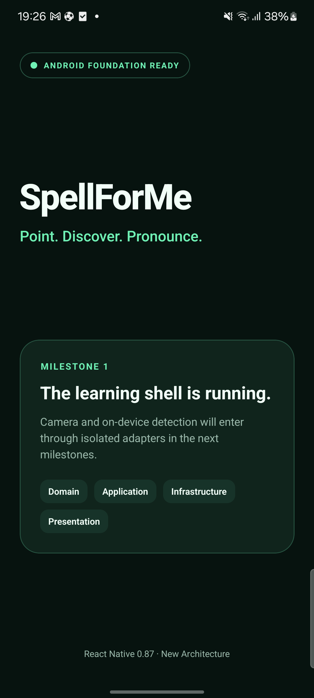
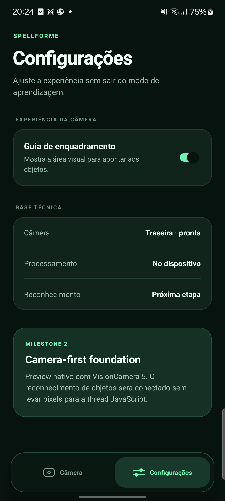

# Android baseline validation

This record makes Milestone 1 reproducible and distinguishes verified behavior
from planned camera and machine-learning work.

## Validation run

- Date: 2026-08-20
- Device: Samsung SM-M536B
- Android: 14 (API 34)
- Connection: physical device over USB
- Application ID: `com.gustavoem.spellforme`
- React Native: 0.87.0
- React: 19.2.3
- Node.js: 24.11.1
- npm: 11.6.2
- Java: 17.0.17
- Gradle: 9.4.1
- Android compile SDK: 37
- Android target SDK: 36
- Android minimum SDK: 24
- React Native New Architecture: enabled
- Hermes: enabled

## Results

The local quality gate passed:

```text
prettier --check .       passed
eslint .                 passed
tsc --noEmit             passed
jest --runInBand         1 suite, 1 test passed
```

The Android debug build completed successfully, installed through ADB, and
started `com.gustavoem.spellforme/.MainActivity`. Android reported the process
running, the activity resumed and visible, and its window fully drawn. The UI
hierarchy contained the expected milestone copy and all four architecture
labels.



## Dependency audit note

On the validation date, `npm audit --omit=dev` reported eight high-severity
findings that resolve to the same transitive `image-size@1.2.1` path through
React Native and Metro. The suggested forced remediation would replace the
React Native 0.87 Metro configuration with 0.86.2, which is a breaking
downgrade.

The advisories identify `2.0.3` as the patched `image-size` version, but that
version has not been published. This is tracked upstream in
[github/advisory-database#9028](https://github.com/github/advisory-database/issues/9028).
The baseline therefore keeps the coherent React Native 0.87 dependency set,
does not apply `npm audit fix --force`, and will re-evaluate the finding when an
installable upstream fix is available.

For the current baseline, the affected package is used by the local Metro asset
pipeline. The app does not ingest untrusted ICNS, JXL, or HEIF assets at
runtime. Repository assets should still be treated as reviewed source input.

## Camera-first validation

The Milestone 2 camera foundation was validated on the same physical Samsung
device on 2026-08-20 with VisionCamera 5.2.2, Nitro Modules 0.37.0, Nitro Image
0.15.2, and styled-components 6.5.3.

The Android build compiled all native camera dependencies, installed, and
launched successfully. After granting the runtime permission, Android's camera
service reported camera `0` open by `com.gustavoem.spellforme` and the UI showed
the live camera state.

Lifecycle behavior was also verified through the Android camera service:

- opening Settings disconnected the camera and left no active camera client;
- returning to Camera reconnected camera `0` to the application;
- disabling the framing guide removed its overlay and enabling it restored the
  overlay without restarting the app.



The updated local quality gate passed with two application interaction tests:

```text
prettier --check .       passed
eslint .                 passed
tsc --noEmit             passed
jest --runInBand         1 suite, 2 tests passed
```

## On-device detector validation

The first complete detector path was validated on the same Samsung device on
2026-08-20 with these pinned components:

```text
VisionCamera                    5.2.2
VisionCamera Worklets           5.2.2
React Native Worklets           0.12.1
Nitro Modules                   0.37.0
MediaPipe Tasks Vision          0.10.35
EfficientDet-Lite0 int8 SHA-256 0720bf247bd76e6594ea28fa9c6f7c5242be774818997dbbeffc4da460c723bb
```

The full Android app compiled and installed with the model packaged at
`assets/efficientdet_lite0_int8.tflite`. Android reported camera `0` active for
the application, the UI received successful detection batches, and no native,
MediaPipe, Worklets, or React fatal error appeared. A live physical-device
sample reported 195 ms inference latency at the requested 640 by 360 RGB frame
resolution.

The camera's current scene did not contain a confidently recognizable COCO
object, so it correctly remained in `PROCURANDO`. A deterministic presentation
test injects a 91% `bottle` detection, lays out the preview, and verifies that
the live overlay shows the word, Portuguese meaning, pronunciation hint, and
confidence without interaction.
Pure mapping tests cover upright and 90-degree frame coordinates plus bounds
clamping.

The current quality gate covers two suites and six tests. Physical validation
of known-object box alignment, latency percentiles, and the five-minute thermal
session remains open and is called out in the roadmap rather than implied as
complete.

## Camera and detector performance validation

The performance-first pipeline was validated on the same physical Samsung
device on 2026-08-21. Measurements below came from the Android debug build with
the camera active and the 640 by 360 RGB FrameOutput enabled.

```text
Metric                    Before         Final
Camera preview            about 10 FPS   29.98 to 30.00 FPS
Detector throughput       about 5 FPS    29.8 to 30.2 FPS
Inference latency         195 ms sample  70 to 112 ms warm samples
Parallel detector workers 1              4
Process CPU               about 150%     about 324% to 339%
Resident memory           about 333 MB   about 529 to 533 MB
```

The selected back camera exposed and negotiated a maximum regular rate of 30
FPS, so the final detector throughput reached the camera's input ceiling. The
native pool keeps one frame per worker and does not queue additional frames.
The preview remained at 30 FPS while all four workers were active.

The device panel advertises 60 and 120 Hz modes. SpellForMe requests the highest
mode after its window is attached, but this device remained at 60 Hz because of
its active Samsung system refresh policy. The app does not silently change the
owner's global display setting.

GPU delegation was tested before selecting the worker pool. The MediaPipe int8
graph rejected that tensor path, while the float32 graph did not complete
reliably on this device. The final version therefore uses the verified int8 CPU
path and documents the trade-off instead of exposing an unverified GPU option.

The final run showed the app process alive, the camera surface stable at 30 FPS,
all four detector workers initialized, repeated throughput windows near 30 FPS,
and no fatal entry in the Android crash buffer. A longer thermal/battery run is
still required before a public performance claim beyond this device and build.
